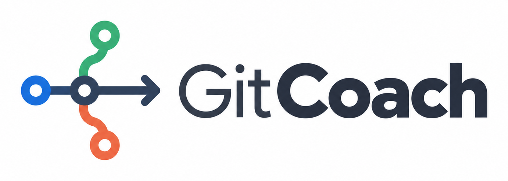

<div align="center">



**Interactive Git assistant that prevents mistakes before they happen.**

[](https://www.npmjs.com/package/gitcoach-cli)
[](https://opensource.org/licenses/Apache-2.0)
[](https://github.com/DNSZLSK/gitcoach-cli)
[](https://github.com/DNSZLSK/gitcoach-cli)

</div>

---

## Quick Start

```bash
npm install -g gitcoach-cli
gitcoach
```

That's it. GitCoach guides you from there, and it needs no API key and no account.

---

## Why GitCoach?

Git is powerful but brutal to beginners: cryptic error messages, lost work from
uncommitted changes, fear of breaking everything.

GitCoach sits in front of Git and catches the mistake before it happens.

- **Prevention first.** Warns about uncommitted changes, detached HEAD and force
  push risks. These checks are plain deterministic rules, not AI guesses, so they
  behave the same way every time.
- **Educational.** Shows every Git command it runs, so you learn while you work.
- **Adapts to you.** Beginner (verbose), Intermediate (balanced), Expert (minimal).
- **Multilingual.** English, French and Spanish.
- **AI optional.** Five Copilot CLI integrations, or a local Ollama model, or
  neither. Every core feature works with no AI at all.

Built for the **[GitHub Copilot CLI Challenge 2026](https://dev.to/challenges/github-2026-01-21)**.

---

## Features

### Interactive menus

Navigate Git with menus instead of memorizing commands.

```
   ██████╗ ██╗████████╗ ██████╗ ██████╗  █████╗  ██████╗██╗  ██╗
  ██╔════╝ ██║╚══██╔══╝██╔════╝██╔═══██╗██╔══██╗██╔════╝██║  ██║
  ██║  ███╗██║   ██║   ██║     ██║   ██║███████║██║     ███████║
  ██║   ██║██║   ██║   ██║     ██║   ██║██╔══██║██║     ██╔══██║
  ╚██████╔╝██║   ██║   ╚██████╗╚██████╔╝██║  ██║╚██████╗██║  ██║
   ╚═════╝ ╚═╝   ╚═╝    ╚═════╝ ╚═════╝ ╚═╝  ╚═╝ ╚═════╝╚═╝  ╚═╝
```

```
? Main Menu
> [S] Status   - View current changes
  [A] Add      - Stage files for commit
  [C] Commit   - Save your changes
  [P] Push     - Upload to remote
  [L] Pull     - Download changes
  [B] Branch   - Manage branches
  [R] Remote   - Configure remote repository
  [V] Tags     - Mark and publish releases
  [U] Undo     - Undo actions (incl. reflog recovery)
  [H] History  - View commit history
  [W] Stash    - Save work temporarily
  [G] Config   - Settings & AI provider
  [X] Advanced - Submodules, worktrees and signing
  [T] Stats    - View your statistics
  [?] Help     - Ask Git questions
  [Q] Quit     - Exit GitCoach
```

### Experience levels

| Level | Menu labels | Confirmations | Warnings | Explanations |
|-------|-------------|---------------|----------|--------------|
| **Beginner** | Full descriptions | All | All | Shown |
| **Intermediate** | Short descriptions | All | Most | Hidden |
| **Expert** | Git commands | Destructive only | Critical only | Hidden |

### Error prevention

GitCoach warns you before you make the mistake, not after:

| Situation | What GitCoach does |
|-----------|--------------------|
| Uncommitted changes | Warns before you switch branches |
| Detached HEAD | Detects it and offers recovery: create a branch, return to main, stash |
| Force push | Requires an explicit confirmation |
| Merge conflicts | Walks you through resolution one block at a time |
| Missing git identity | Sets `user.name` and `user.email` before your first commit fails |
| Secrets and large files | Warns before staging `.env`, keys, `node_modules` or files over 50 MB |
| Lost commits | Recovers them from the reflog via the Undo menu, on a rescue branch |
| Interrupted rebase, cherry-pick, merge or bisect | Detects it on launch and offers continue, skip or cancel |
| Amending a pushed commit | Warns that it rewrites shared history before you do it |

### Educational mode

Every action shows the Git command being executed:

```
? Stage all files? Yes
  > git add -A
  5 file(s) staged successfully.
```

You learn Git while using GitCoach. Eventually you will not need it anymore.
That is the goal.

### Branch management

Create, switch, merge and delete branches with guidance:

```
? Select an option
> Create a new branch
  Switch branch
  Merge a branch
  Delete a branch
  Back
```

### Multilingual support

English, French and Spanish, including localized confirmations:

| Language | Prompt |
|----------|--------|
| English | `(Y/n)` |
| French | `(O/n)` |
| Spanish | `(S/n)` |

### Tags and releases

Tagging is the release workflow, so it gets its own menu:

```
? Tags & Releases
> [L] List tags
  [C] Create a tag
  [P] Push tags to remote
  [D] Delete a tag
```

Creating explains that a message is what makes a tag annotated, then offers
to push it. Deleting removes it locally first and only offers the remote
deletion when the tag is actually published there.

### Rewriting history, carefully

| Operation | Where | Guard rail |
|-----------|-------|------------|
| Amend the last commit | offered right after committing, and in Undo | warns when the commit is already pushed |
| Revert a commit | Undo | shows the message git will generate before confirming |
| Rebase onto a branch | Branch | refuses on a dirty tree, counts the published commits |
| Squash commits | Branch | lists the commits that will disappear |

### Getting unstuck

If git stopped part-way through a rebase, cherry-pick, merge or bisect,
GitCoach detects it on launch and offers the way out rather than just
reporting the state:

```
Operation in progress
  A rebase is in progress. Step 2 of 3.
  1 file(s) still contain conflict markers.

> [R] Open conflict resolution
  [S] Skip this commit and continue
  [A] Cancel and go back to the starting point
  [I] Leave it as it is for now
```

### Inspecting history

From the History menu: the patch a commit introduced, blame on any tracked
file, and a comparison between two branches.

### Advanced

Submodules (status, init, update, add), worktrees (list, add, remove) and
commit signing (key, on, off). Grouped under one entry so the main menu stays
readable.

---

## AI features

GitCoach uses Copilot CLI in **five distinct ways**. All of them are optional:
the tool is fully usable without any AI provider.

### 1. Smart commit messages

Copilot analyzes your staged diff and suggests a conventional commit message.
GitCoach validates the reply before proposing it, so model chatter never becomes
your commit subject, and you always confirm before it is used.

```
  Suggested: feat(auth): add OAuth2 authentication
? Use this message? (Y/n)
```

### 2. Git Q&A

Ask any Git question in natural language from the Help menu:

```
? Your question: What is the difference between merge and rebase?

  MERGE creates a merge commit, preserving history.
  REBASE rewrites history by moving commits.
  Use merge for shared branches, rebase for local cleanup.
```

### 3. Staged diff summary

Before committing, Copilot summarizes your staged changes so you can review the
intent of your work before saving it:

```
+-------------- Summary of Changes ---------------+
|                                                  |
|  Modified auth module: added OAuth2 flow with    |
|  token refresh. Updated user model to store      |
|  refresh tokens.                                 |
|                                                  |
+--------------------------------------------------+
```

### 4. Contextual error explanation

When a Git operation fails, Copilot explains the error in plain language
alongside the built-in help:

```
  Error: failed to push some refs to 'origin/main'

+--------------- AI Explanation ------------------+
|                                                 |
|  Your local branch is behind the remote. Pull   |
|  the latest changes first with 'git pull', then |
|  try pushing again.                             |
|                                                 |
+-------------------------------------------------+
```

### 5. AI-assisted conflict resolution

When merge conflicts occur, GitCoach shows both versions and offers five
options, including asking Copilot for a recommendation. Nothing is written to
your file until you accept:

```
  Your version (local):
    name: master-version

  Remote version:
    name: feature-version

? What do you want to keep?
> Keep my version (local)
  Keep the remote version
  Keep both (combine)
  Edit manually in my editor
  Ask Copilot AI

  Copilot suggests: CUSTOM
  Neither version alone is correct. The optimal solution
  is to keep a merged version that maintains backward
  compatibility while accommodating the feature.

? Accept this suggestion? (Y/n)
```

All Copilot responses respect your language configuration.

### Bring your own LLM

The AI layer is provider-agnostic. GitHub Copilot CLI is the default, but you can
switch to a local **Ollama** model (no API key, fully offline) from
**Settings > AI Provider**. Useful for privacy, or for working without Copilot.

---

## Commands

| Command | Description |
|---------|-------------|
| `gitcoach` | Launch the interactive menu |
| `gitcoach quick` | Fast commit and push (expert mode) |
| `gitcoach init` | First-time setup |
| `gitcoach config` | Change settings |
| `gitcoach stats` | View your statistics |

---

## Installation

### Node.js 18 or higher

| Platform | How |
|----------|-----|
| Windows | Download the LTS build from [nodejs.org](https://nodejs.org/) |
| macOS | `brew install node` |
| Linux (Debian/Ubuntu) | Follow the [NodeSource setup](https://github.com/nodesource/distributions) |

### Git

| Platform | How |
|----------|-----|
| Windows | Download from [git-scm.com](https://git-scm.com/download/win) |
| macOS | `brew install git` |
| Linux (Debian/Ubuntu) | `sudo apt-get install git` |

### GitHub Copilot CLI (optional)

Only needed for the AI features listed above:

```bash
npm install -g @github/copilot
copilot login
```

GitCoach works fine without it. Every core feature is available with no AI
provider configured.

---

## Development

```bash
git clone https://github.com/DNSZLSK/gitcoach-cli.git
cd gitcoach-cli
npm install
npm run build
npm test
npm link
gitcoach
```

## Project structure

```
gitcoach-cli/
├── bin/              # CLI entry point
├── src/
│   ├── commands/     # CLI commands
│   ├── config/       # Configuration management
│   ├── i18n/         # Translations (en, fr, es)
│   ├── services/     # Git ops + AI providers (ai/: Copilot, Ollama)
│   ├── ui/
│   │   ├── components/   # Reusable UI components
│   │   ├── menus/        # Interactive menus
│   │   └── themes/       # Color themes
│   └── utils/        # Helpers, validators
├── test/             # 871 tests
└── docs/             # Documentation
```

Built with TypeScript, [Inquirer.js](https://github.com/SBoudrias/Inquirer.js),
[simple-git](https://github.com/steveukx/git-js), cross-spawn (shell-free AI CLI
calls), [i18next](https://www.i18next.com/), Chalk and Jest.

---

## Contributing

1. Fork the repository
2. Create a feature branch (`git checkout -b feature/amazing-feature`)
3. Commit your changes (`git commit -m 'feat: add amazing feature'`)
4. Push to the branch (`git push origin feature/amazing-feature`)
5. Open a Pull Request

## Links

- **npm:** [npmjs.com/package/gitcoach-cli](https://www.npmjs.com/package/gitcoach-cli)
- **GitHub:** [github.com/DNSZLSK/gitcoach-cli](https://github.com/DNSZLSK/gitcoach-cli)
- **DEV.to:** [GitCoach, the Git mentor that teaches you while you work](https://dev.to/dnszlsk/gitcoach-the-git-mentor-that-teaches-you-while-you-work-github-copilot-cli-challenge-1708)
- **Issues:** [github.com/DNSZLSK/gitcoach-cli/issues](https://github.com/DNSZLSK/gitcoach-cli/issues)
- **Changelog:** [CHANGELOG.md](CHANGELOG.md)

## Author

**DNSZLSK**, CDA student at AFPA, France.

Built for the [GitHub Copilot CLI Challenge 2026](https://dev.to/challenges/github-2026-01-21).

## License

Apache License 2.0. Copyright 2026 DNSZLSK. See [LICENSE](LICENSE).

You may use, modify and redistribute this code, including commercially,
as long as you keep the copyright notice, state your changes and include
a copy of the licence. The licence does not grant rights to the GitCoach
name itself.
